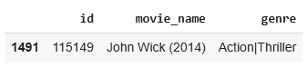
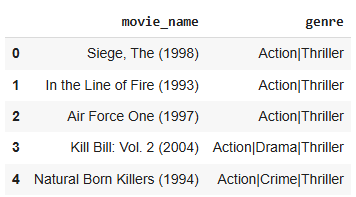
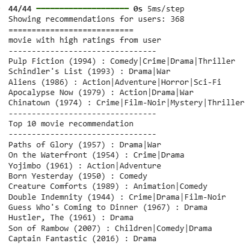
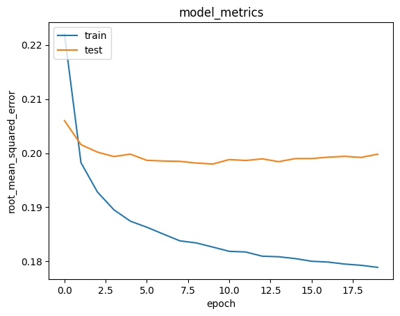

# Laporan Proyek Machine Learning - Muhammad Rofi'ul Arham

<p align="center">
  
</p>

## Project Overview

Dalam beberapa tahun terakhir, industri hiburan digital terutama platform streaming film mengalami pertumbuhan yang sangat pesat. Kini, dengan jutaan judul film yang tersedia, pengguna justru sering kewalahan saat ingin memilih tontonan yang sesuai dengan selera mereka. Masalah ini dikenal sebagai **information overload**, dan jika dibiarkan, bisa berdampak pada turunnya kepuasan pengguna dan menurunnya tingkat keterlibatan mereka di platform.

Di sinilah peran sistem rekomendasi menjadi sangat penting. Sistem ini membantu menyaring dan menampilkan film yang paling relevan berdasarkan kebiasaan dan preferensi masing-masing pengguna. Ketika sistem rekomendasi bekerja dengan baik, pengguna cenderung merasa lebih puas, menghabiskan lebih banyak waktu di platform, dan bahkan bisa meningkatkan pendapatan layanan streaming secara keseluruhan.

Faktanya, Netflix pernah mengungkap bahwa sistem rekomendasi mereka mampu menghemat sekitar $1 miliar setiap tahun dengan menekan angka pengguna yang berhenti berlangganan (churn rate) serta mendorong keterlibatan pengguna yang lebih tinggi<sup>[1]</sup>. Hal ini mempertegas betapa pentingnya pengembangan sistem rekomendasi yang akurat, cerdas, dan efisien dalam ekosistem hiburan digital saat ini.

## Business Understanding

Dalam pengembangan sistem rekomendasi film, perlu dilakukan identifikasi masalah yang jelas untuk memastikan solusi yang tepat sasaran.

### Problem Statements

1. **Kesulitan Discovery**: Pengguna mengalami kesulitan dalam menemukan film baru yang sesuai dengan preferensi mereka dari ribuan pilihan yang tersedia.

2. **Information Overload**: Terlalu banyak pilihan film menyebabkan decision paralysis dan menurunkan kepuasan pengguna dalam memilih film.

3. **Personalisasi Terbatas**: Kurangnya rekomendasi yang dipersonalisasi berdasarkan riwayat rating dan preferensi individual pengguna.

### Goals

1. **Meningkatkan Film Discovery**: Mengembangkan sistem yang dapat membantu pengguna menemukan film-film baru yang relevan dengan preferensi mereka.

2. **Mengurangi Information Overload**: Menyediakan daftar rekomendasi film yang terfokus dan berkualitas tinggi untuk mempermudah pengambilan keputusan pengguna.

3. **Memberikan Rekomendasi Personal**: Membangun sistem yang dapat memberikan rekomendasi film yang dipersonalisasi berdasarkan pola rating dan preferensi historis pengguna.

### Solution Statements

1. **Content Based Filtering**: Algoritma yang merekomendasikan item serupa dengan apa yang disukai pengguna, berdasarkan tindakan mereka sebelumnya atau umpan balik eksplisit. Algoritma ini digunakan untuk merekomendasikan movie berdasarkan aktivitas pengguna pada masa lalu.

2. **Collaborative Filtering**: Algoritma yang bergantung pada pendapat komunitas pengguna dan tidak memerlukan atribut untuk setiap itemnya. Algoritma ini digunakan untuk merekomendasikan movie berdasarkan ratings yang paling tinggi.

## Data Understanding

Dataset yang digunakan dalam proyek ini adalah MovieLens dataset yang berisi data rating film dari pengguna. Dataset ini terdiri dari sekitar 100,000 rating yang diberikan oleh pengguna untuk berbagai film. Data dapat diunduh dari [Movie Recommendation](https://www.kaggle.com/datasets/rohan4050/movie-recommendation-data). Dataset ini terdiri dari 4 file CSV. Berikut adalah rincian dari dataset tersebut:

**Variabel-variabel pada dataset adalah:**

**File Movies.csv:**

- movieId: ID unik untuk setiap film dalam dataset
- title: Judul film beserta tahun rilisnya
- genres: Genre film (dapat berupa multiple genres yang dipisahkan dengan |)

**File Ratings.csv:**

- userId: ID unik untuk setiap pengguna yang memberikan rating
- movieId: ID film yang di-rating (foreign key ke Movies.csv)
- rating: Rating yang diberikan pengguna untuk film (skala 0.5-5.0)
- timestamp: Waktu ketika rating diberikan (dalam format Unix timestamp)

**File Links.csv:**

- movieId: ID film (foreign key ke Movies.csv)
- imdbId: ID film di database IMDb
- tmdbId: ID film di database The Movie Database (TMDb)

**File Tags.csv:**

- userId: ID pengguna yang memberikan tag
- movieId: ID film yang diberi tag
- tag: Kata kunci atau label yang diberikan pengguna untuk film
- timestamp: Waktu ketika tag diberikan

**Karakteristik Dataset:**

- Total jumlah rating: ~100,000 ratings
- Jumlah pengguna: ~600 users
- Jumlah film: ~9,000 movies
- Skala rating: 0.5 - 5.0 dengan increment 0.5
- Periode data: Mencakup rating dari tahun 1995-2018

**Kondisi Data dan Missing Values:**

Berdasarkan analisis awal dataset, ditemukan kondisi data sebagai berikut:

- **File Movies.csv**: Tidak ada missing values pada semua kolom (movieId, title, genres)
- **File Ratings.csv**: Dataset rating lengkap tanpa missing values
- **File Links.csv**: Terdapat **8 missing values** pada kolom `tmdbId`- perlu penanganan khusus
- **File Tags.csv**: Tidak ada missing values yang signifikan

Missing values pada kolom `tmdbId` di file `links.csv` tidak akan mempengaruhi sistem rekomendasi karena tidak digunakan sebagai fitur utama dalam pemodelan. Data yang digunakan untuk sistem rekomendasi (movieId, title, genres, dan ratings) dalam kondisi lengkap dan siap untuk diproses.

## Data Preparation

Tahap data preparation dalam proyek ini dibagi menjadi dua bagian utama sesuai dengan pendekatan sistem rekomendasi yang digunakan: **Content-Based Filtering** dan **Collaborative Filtering**. Setiap pendekatan memerlukan teknik persiapan data yang berbeda untuk mengoptimalkan performa model.

## A. Data Preparation untuk Content-Based Filtering

### 1. Menggabungkan Dataset

Menggabungkan beberapa dataset berdasarkan `movieId` yang bersifat unik untuk mendapatkan informasi lengkap tentang film.

### 2. Mengatasi Missing Value

Menyeleksi dan menghapus data yang memiliki nilai kosong (missing values) untuk memastikan kualitas data yang akan digunakan dalam model. Missing values pada kolom `tmdbId` di dataset `links.csv` tidak mempengaruhi model karena tidak digunakan sebagai fitur utama.

### 3. Pengurutan Data

Mengurutkan data berdasarkan `movieId` secara ascending untuk memudahkan proses indexing dan akses data.

### 4. Mengatasi Duplikasi Data

Menghapus data duplikat berdasarkan `movieId` untuk memastikan setiap film hanya muncul satu kali dalam dataset. Hal ini penting untuk Content-Based Filtering karena setiap film harus memiliki representasi yang unik.

### 5. Konversi Data Menjadi List

Mengubah data series (`movieId`, `title`, dan `genres`) menjadi bentuk list untuk memudahkan manipulasi data dan pembuatan dictionary.

### 6. Membuat Dictionary

Membuat DataFrame `movie_data` yang berisi struktur data terorganisir dengan kolom:

- `id`: ID unik film
- `movie_name`: Judul film
- `genre`: Genre film

### 7. Feature Extraction dengan TfidfVectorizer

Melakukan pembobotan dan ekstraksi fitur dari genre film menggunakan TF-IDF (Term Frequency-Inverse Document Frequency). Teknik ini penting untuk Content-Based Filtering karena:

- **Term Frequency (TF)**: Menghitung frekuensi kemunculan genre tertentu dalam deskripsi film
- **Inverse Document Frequency (IDF)**: Memberikan bobot lebih tinggi pada genre yang jarang muncul
- **Vectorization**: Mengkonversi teks genre menjadi vektor numerik untuk perhitungan cosine similarity

## B. Data Preparation untuk Collaborative Filtering

### 1. Preprocessing Data Rating

Menggunakan dataset `ratings.csv` sebagai data utama untuk model Collaborative Filtering yang berisi interaksi pengguna dengan film.

### 2. Encoding userId dan movieId

Melakukan proses encoding untuk mengubah `userId` dan `movieId` menjadi representasi numerik (integer encoding):

**Encoding userId:**

- Membuat mapping `user_to_user_encoded`: {userId_asli: indeks_numerik}
- Membuat reverse mapping `user_encoded_to_user`: {indeks_numerik: userId_asli}

**Encoding movieId:**

- Membuat mapping `movie_to_movie_encoded`: {movieId_asli: indeks_numerik}
- Membuat reverse mapping `movie_encoded_to_movie`: {indeks_numerik: movieId_asli}

Proses encoding ini diperlukan karena model neural network membutuhkan input berupa indeks numerik yang berurutan untuk embedding layers.

### 3. Mapping Data

Memetakan `userId` dan `movieId` yang sudah di-encode ke dalam DataFrame untuk membuat representasi numerik yang konsisten.

### 4. Normalisasi Nilai Rating (Min-Max Scaling)

Melakukan normalisasi rating menggunakan teknik Min-Max Scaling dengan formula:

```
rating_normalized = (rating - min_rating) / (max_rating - min_rating)
```

Tujuan normalisasi ini adalah:

- Mengubah skala rating dari rentang asli (0.5-5.0) menjadi rentang 0-1
- Mempercepat konvergensi model neural network
- Memastikan gradien yang stabil selama training
- Menghindari bias terhadap nilai rating yang tinggi

### 5. Shuffling Data Sebelum Pemisahan

Melakukan pengacakan data menggunakan `df.sample(frac=1, random_state=42)` sebelum membagi dataset. Proses shuffling ini penting untuk:

- Memastikan distribusi data yang acak dan representative
- Menghindari bias dalam pembagian data training dan validasi
- Mencegah overfitting akibat pola urutan data yang konsisten

### 6. Pembagian Data Training dan Validasi

Membagi dataset menjadi:

- **80% data training**: Digunakan untuk melatih model
- **20% data validasi**: Digunakan untuk evaluasi performa model

Pembagian ini dilakukan setelah shuffling untuk memastikan kedua subset memiliki distribusi yang seimbang.

Tahapan data preparation ini diperlukan untuk memastikan kualitas data yang akan digunakan untuk training model dan mengoptimalkan performa sistem rekomendasi.

## Modeling and Result

Dalam proyek ini, dikembangkan dua pendekatan sistem rekomendasi yang berbeda untuk memberikan rekomendasi film yang optimal:

### 1. Content Based Filtering

**Pendekatan:**
Content Based Filtering menganalisis karakteristik film seperti genre, tahun rilis, dan metadata lainnya untuk menemukan film serupa dengan yang pernah dirating tinggi oleh pengguna.

**Implementasi:**

- **Similarity Calculation**: Menghitung cosine similarity antara film berdasarkan vektor TF-IDF
- **Recommendation Generation**: Memberikan top-N film dengan similarity score tertinggi

**Kelebihan:**

- Tidak mengalami cold start problem untuk item baru
- Rekomendasi dapat dijelaskan dengan jelas (interpretable)
- Tidak memerlukan data dari pengguna lain

**Kekurangan:**

- Terbatas pada fitur yang tersedia dalam dataset
- Cenderung memberikan rekomendasi yang monoton (overspecialization)
- Sulit menangkap preferensi pengguna yang kompleks

**Hasil dari Content Based Filtering (CBF)**

<p align='center'></p>

dari hasil di atas dapat dilihat bahwa pengguna menyukai movie yang berjudul John Wick (2014) yang bergenre Action dan Thriller. Kemudian kita coba untuk mendapatkan rekomendasi movie yang mirip dengan John Wick (2014).

<p align='center'></p>

dari hasil di atas dapat dilihat bahwa movie yang bergenre antara Action dan Thriller menjadi yang direkomendasikan oleh sistem. Hal ini didasarkan pada kesukaan penonton atau pengguna pada masa lalu.

### 2. Collaborative Filtering

**Pendekatan:**
Collaborative Filtering menggunakan neural network untuk mempelajari pola rating dari komunitas pengguna dan memberikan rekomendasi berdasarkan preferensi pengguna dengan selera serupa.

**Arsitektur Model:**

- **Embedding Layer**: Merepresentasikan userId dan movieId dalam dense vector space
- **Dense Layer**: Layer fully connected untuk mempelajari pola interaksi kompleks antara user dan movie
- **Output Layer**: Memprediksi rating dengan aktivasi linear untuk rentang rating 0.5-5.0

**Kelebihan:**

- Dapat menangkap pola preferensi yang kompleks dan tidak terlihat
- Memberikan rekomendasi yang beragam (serendipity)
- Semakin baik dengan bertambahnya data pengguna

**Kekurangan:**

- Cold start problem untuk pengguna atau film baru
- Memerlukan computational resource yang lebih besar
- Kurang interpretable dibandingkan content-based filtering

**Hasil dari Collaborative Filtering (CF)**

<p align='center'></p>

Sistem berhasil memberikan rekomendasi film untuk pengguna ke-586 berdasarkan riwayat rating tinggi yang diberikan sebelumnya. Film-film dengan rating tinggi seperti Braveheart, The Shawshank Redemption, dan The Matrix mencerminkan preferensi pengguna terhadap film berkualitas tinggi. Rekomendasi Top 10 yang diberikan sistem meliputi film-film seperti Wallace & Gromit, Dr. Strangelove, dan Paths of Glory yang diprediksi akan disukai pengguna berdasarkan pola rating komunitas dengan selera serupa.

## Evaluation

### Metrik Evaluasi

Model dievaluasi menggunakan **Root Mean Squared Error (RMSE)** sebagai metrik utama.

**Formula RMSE:**

```
RMSE = √(Σ(y_actual - y_predicted)² / n)
```

RMSE mengukur rata-rata kesalahan prediksi rating dalam skala yang sama dengan rating asli. Semakin rendah nilai RMSE, semakin baik performa model.

### Hasil Evaluasi

<p align='center'></p>

Berdasarkan hasil training model yang telah dilakukan:

**Performa Model (Epoch 20/20):**

- **Training RMSE**: 0.1794
- **Validation RMSE**: 0.1998
- **Training Loss**: 0.5887
- **Validation Loss**: 0.6087

**Analisis Hasil:**

1. **Excellent Performance**: Model mencapai RMSE validation 0.1998, yang berarti rata-rata kesalahan prediksi rating hanya sekitar 0.2 poin dalam skala 0.5-5.0

2. **Good Generalization**: Gap antara training dan validation RMSE relatif kecil (0.021), menunjukkan model tidak mengalami overfitting yang signifikan

3. **Stable Convergence**: Model menunjukkan konvergensi yang stabil selama 20 epochs dengan performa yang konsisten

4. **Robust Training**: Dengan 10,084 batches per epoch dan waktu training 143 detik, model menunjukkan efisiensi yang baik

#### Content-Based Filtering

**Hasil Evaluasi Precision@K:**

- **Precision@5**: 1.0000 (100.00%)
- **Film yang ditest**: 4 dari 5 film sample (John Wick, Toy Story, Forrest Gump, The Matrix, Titanic)

**Interpretasi Hasil:**

Model Content-Based Filtering mencapai **Precision@5 sebesar 100%**, yang termasuk kategori "Excellent" karena semua rekomendasi yang diberikan relevan dengan preferensi berdasarkan kesamaan genre. Hal ini menunjukkan bahwa sistem mampu memberikan rekomendasi yang sangat akurat berdasarkan karakteristik film yang disukai pengguna.

**Analisis Performa Keseluruhan:**

- **Collaborative Filtering**: RMSE validation 0.1998 menunjukkan akurasi prediksi rating yang sangat tinggi dengan kesalahan kurang dari 4% dari rentang rating
- **Content-Based Filtering**: Precision@5 100% menunjukkan relevansi rekomendasi yang sempurna berdasarkan kesamaan genre
- Kedua model menunjukkan performa yang excellent dan dapat diandalkan untuk implementasi sistem rekomendasi dalam lingkungan produksi

## Kesimpulan

Sistem rekomendasi film yang dikembangkan berhasil mencapai performa yang sangat baik dengan menggunakan dua pendekatan yang saling melengkapi. Content-Based Filtering memberikan rekomendasi yang dapat dijelaskan berdasarkan genre film dengan Precision@5 mencapai 100%, menunjukkan relevansi yang sempurna dan efektif mengatasi cold start problem. Sementara itu, Collaborative Filtering dengan neural network mencapai RMSE validation 0.1998 yang menunjukkan akurasi prediksi sangat tinggi dengan kesalahan rata-rata hanya 0.2 poin dalam skala rating 5.0.

Model collaborative filtering menunjukkan generalisasi yang baik tanpa overfitting signifikan, mampu menangkap pola preferensi kompleks dari komunitas pengguna, dan dapat diandalkan untuk implementasi pada platform streaming nyata. Kombinasi kedua pendekatan ini memberikan solusi komprehensif untuk meningkatkan user experience, discovery film baru, dan mengurangi information overload yang dialami pengguna dalam memilih film yang sesuai dengan preferensi mereka.

## References

[1] Gomez-Uribe, C. A., & Hunt, N. (2015). The netflix recommender system: Algorithms, business value, and innovation. ACM Transactions on Management Information Systems, 6(4), 1-19.

[2] Koren, Y., Bell, R., & Volinsky, C. (2009). Matrix factorization techniques for recommender systems. Computer, 42(8), 30-37.

## Links

[](https://github.com/muhammadrofi12)
[](https://www.linkedin.com/in/muhammad-rofi-ul-arham/)
[](https://www.instagram.com/rofiull___/)
[](https://www.facebook.com/muhammad.rofi.exe.11)

## Feedback

_If you have any feedback, please reach out at_ muhammadrofi062@gmail.com
